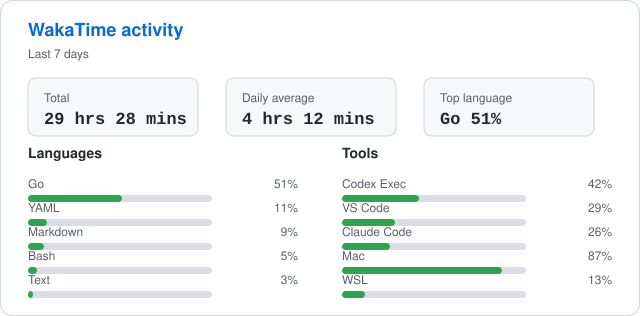

  

<h1 align="center">Hey, I'm Igor Rocha</h1>

  Senior Software Engineer focused on backend systems, Go, software architecture, and tests.
   
  Studying Information Systems at Instituto Federal de Alagoas.

  

## What I care about

- Building reliable services that are simple to operate and change.
- Designing boundaries that keep systems understandable over time.
- Writing tests that make refactoring feel boring in the best way.
- Improving developer experience through clear code, tooling, and feedback loops.

## Now

- Working mostly with backend engineering and system design.
- Deepening my practice around Go, architecture, and testing.
- Keeping an eye on pragmatic ways to ship better software with smaller feedback cycles.

## Activity

  

